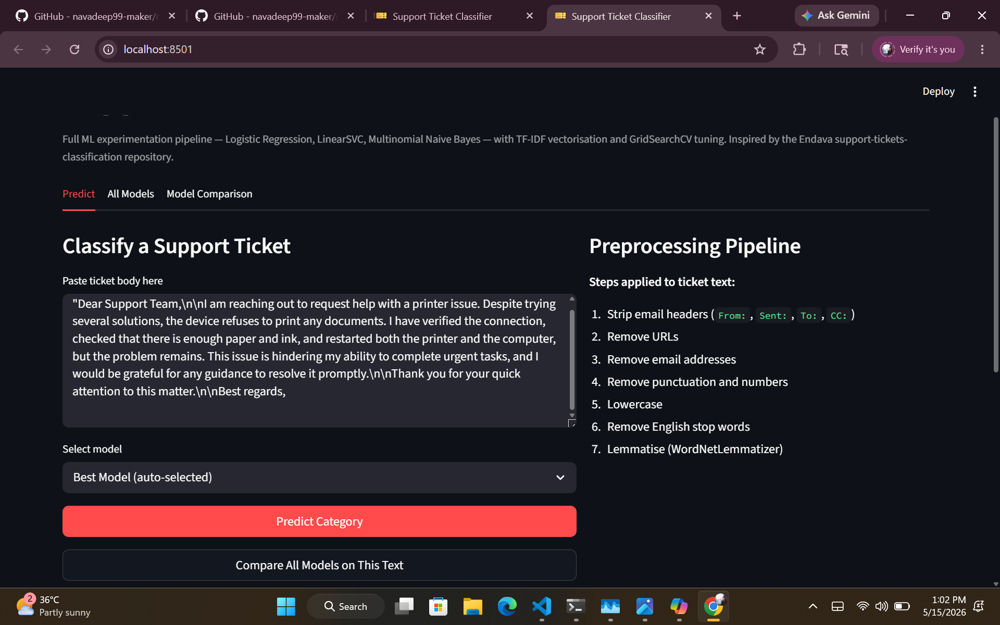
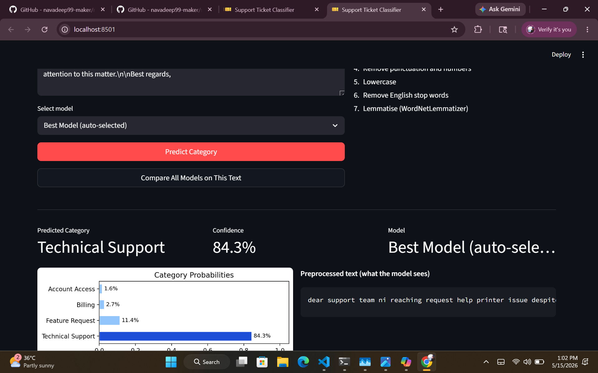
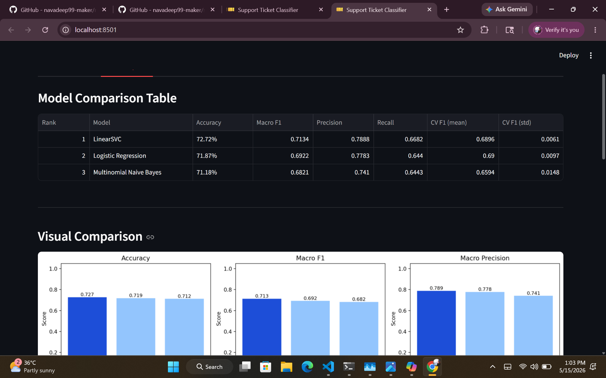

# Support Ticket Classifier

Classical NLP pipeline for multi-class IT support ticket classification.
Classifies ticket text into four categories using TF-IDF vectorisation and three
scikit-learn classifiers, with GridSearchCV tuning and a Streamlit web UI.
Built for a dataset of 5k+ labeled support tickets, this multi-class prediction system
covers Account Access, Billing, Feature Request, and Technical Support.

**Categories:** Account Access · Billing · Feature Request · Technical Support

---

## Features

- Text preprocessing: email header stripping, URL removal, lemmatisation, stopword removal
- TF-IDF vectorisation with word n-grams (1–3) and character n-grams (`char_wb`)
- Three classifiers: Logistic Regression, LinearSVC, Multinomial Naive Bayes
- Joint TF-IDF + classifier hyperparameter tuning via `GridSearchCV(scoring="f1_macro")`
- Full evaluation: accuracy, macro F1/precision/recall, confusion matrices, 5-fold CV
- Streamlit app for interactive prediction and side-by-side model comparison
- Reproducible: all models, vectorizers, and reports are auto-generated at runtime

---

## NLP Pipeline

```
Raw ticket text
    │
    ▼  src/preprocess.py
    Strip email headers (From:, Sent:, To:, CC:, Subject:)
    Remove URLs and email addresses
    Remove punctuation and numbers
    Lowercase
    NLTK stopword removal
    WordNetLemmatizer
    │
    ▼  TF-IDF vectorisation
    Word n-grams:      unigrams, bigrams, trigrams
    Character n-grams: char_wb (3–5) — handles error codes, abbreviations, typos
    GridSearchCV over: ngram_range, max_features, min_df, max_df, sublinear_tf
    │
    ▼  Classifier (GridSearchCV joint tuning)
    LogisticRegression     — softmax multi-class, L2 regularisation, liblinear/saga
    LinearSVC              — max-margin classifier; CalibratedClassifierCV for probabilities
    MultinomialNB          — generative word-count model; Laplace smoothing via alpha
    │
    ▼  src/evaluate.py
    Accuracy, macro F1 / precision / recall
    Confusion matrix heatmap (seaborn)
    Per-class classification report
    5-fold stratified cross-validation
```

**Why character n-grams?**
Support tickets contain error codes (`0x8009030C`, `LDAP Error 49`), acronyms
(`MFA`, `VPN`, `SSO`), and informal abbreviations that word tokenisation fragments
or discards. Character-level n-grams within word boundaries produce partial overlaps
that survive OOV terms, typos, and hyphenated variants, giving the classifier
robust sub-word signal.

---

## Results

Trained on 800 synthetic IT support tickets — 80 / 20 stratified split.

| Rank | Model | Accuracy | Macro F1 | CV Macro F1 |
|------|-------|----------|----------|-------------|
| 1 | LinearSVC | 72.72% | 0.7134 | 0.6896 ± 0.006 |
| 2 | Logistic Regression | 71.87% | 0.6922 | 0.6900 ± 0.010 |
| 3 | Multinomial NB | 71.19% | 0.6821 | 0.6594 ± 0.015 |

> Results from initial training. Re-running `run_all.py` with the expanded GridSearchCV
> grids may produce different values.

---

## Streamlit UI

```
streamlit run streamlit_app.py
```

Three tabs:

- **Predict** — classify any ticket; shows predicted category, confidence score,
  full probability breakdown per class, and the preprocessed text the model saw
- **All Models** — confusion matrices, classification reports, per-class metrics,
  top TF-IDF features, and GridSearchCV tuning results for each model
- **Model Comparison** — ranked table, CV scores, bar chart, best model summary

---

## Project Structure

```
nlp-project/
├── data/
│   └── support_tickets.csv        ← not tracked; add dataset here
├── models/
│   ├── trained/                   ← .pkl pipelines (auto-generated)
│   ├── vectorizers/               ← TF-IDF vectorizers per model (auto-generated)
│   └── metrics/                   ← JSON metric files per model (auto-generated)
├── outputs/
│   ├── confusion_matrices/        ← PNG heatmaps (auto-generated)
│   ├── reports/                   ← classification reports, tuning CSVs (auto-generated)
│   └── comparison_tables/         ← model_comparison.csv, model_ranking.txt (auto-generated)
├── src/
│   ├── preprocess.py              ← text cleaning, lemmatisation, label encoding
│   ├── features.py                ← TF-IDF utilities, vocabulary analysis
│   ├── evaluate.py                ← all evaluation and reporting functions
│   ├── train_logreg.py            ← Logistic Regression (standalone or via run_all)
│   ├── train_svm.py               ← LinearSVC
│   ├── train_naivebayes.py        ← Multinomial NB
│   ├── compare_models.py          ← model comparison + best model selection
│   ├── predict.py                 ← inference functions + CLI
│   └── utils.py                   ← shared paths and persistence helpers
├── generate_tickets.py            ← synthetic dataset generator (800 tickets)
├── run_all.py                     ← full pipeline orchestrator
├── streamlit_app.py               ← Streamlit web UI
└── requirements.txt
```

> `models/`, `outputs/`, and `data/` folder structure is tracked via `.gitkeep` files.
> All generated content (models, reports, plots) is excluded from the repository.

---

## How to Reproduce

This repository does **not** include the dataset, trained models, vectorizers, or
output files. Run the steps below to regenerate everything locally.

### 1. Clone and create a virtual environment

```bash
git clone <your-repo-url>
cd nlp-project

python -m venv venv

# Windows
venv\Scripts\activate

# macOS / Linux
source venv/bin/activate
```

### 2. Install dependencies

```bash
pip install -r requirements.txt
```

### 3. Download NLTK data

```bash
python -c "import nltk; nltk.download('stopwords'); nltk.download('wordnet'); nltk.download('omw-1.4')"
```

### 4. Add the dataset

Place your CSV at `data/support_tickets.csv`.

Required columns: `body`, `category`, `urgency`, `impact`

Valid category values: `Account Access`, `Billing`, `Feature Request`, `Technical Support`

If you do not have a dataset, generate 800 synthetic tickets:

```bash
python generate_tickets.py
```

### 5. Run the full training pipeline

```bash
python run_all.py
```

Trains all three models, evaluates each, saves models and reports, then selects the
best model as `models/trained/best_model.pkl`.

**Expected runtime:** 5–20 minutes on a standard CPU (`n_jobs=-1` parallelises GridSearchCV).

### 6. Train individual models

```bash
python src/train_svm.py
python src/train_logreg.py
python src/train_naivebayes.py
```

Each script is fully standalone — it loads and splits the data internally if not
called from `run_all.py`.

### 7. Run the Streamlit app

```bash
streamlit run streamlit_app.py
```

Opens at `http://localhost:8501`. Requires at least one trained model in `models/trained/`.

### Expected output after a full run

```
models/trained/       logreg.pkl, linearsvc.pkl, naivebayes.pkl, best_model.pkl,
                      label_encoder.pkl
models/vectorizers/   logreg_tfidf.pkl, linearsvc_tfidf.pkl, naivebayes_tfidf.pkl
models/metrics/       logreg_metrics.json, linearsvc_metrics.json, naivebayes_metrics.json
outputs/confusion_matrices/   logreg_cm.png, linearsvc_cm.png, naivebayes_cm.png
outputs/reports/      *_report.txt, *_per_class.csv, *_tuning.csv, *_top_features.txt
outputs/comparison_tables/    model_comparison.csv, model_ranking.txt
```

---

## Screenshots

### Predict Tab

### Predict Tab

### Model Comparison Tab


<!-- Add screenshots of the Streamlit UI after first run -->
<!-- Predict tab / Model Comparison tab -->

---

## Future Improvements

- Scale training data beyond 800 tickets for more stable evaluation
- Experiment with `SGDClassifier` and `PassiveAggressiveClassifier`
- Add SHAP or LIME for per-prediction feature explanations
- Explore cross-lingual ticket classification

---

## Dependencies

```
pandas  numpy  scikit-learn  nltk  matplotlib  seaborn  joblib  streamlit
```

See `requirements.txt` for pinned versions.

---

*Inspired by the [Endava support-tickets-classification](https://github.com/karolzak/support-tickets-classification) repository.*
